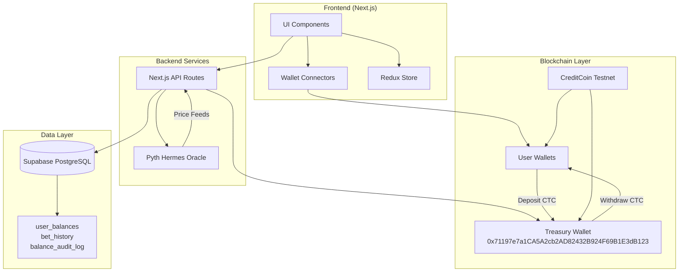

# Design Document: CreditNomo Migration

## Overview

Bu design dokümanı, mevcut Binomo oyununun BNB Chain'den CreditCoin testnet'e tam migrasyonunu detaylandırır. Proje, blockchain altyapısını, token sistemini, veritabanı şemasını ve tüm ilgili entegrasyonları CreditCoin ekosistemi için yeniden yapılandırmayı içerir.

### Migration Scope

**Değişen Bileşenler:**
- Blockchain network: BNB Chain → CreditCoin testnet
- Native token: BNB → CTC (18 decimals)
- Chain ID: 56 → 102031
- RPC endpoint: BNB RPC → https://rpc.cc3-testnet.creditcoin.network
- Block explorer: BscScan → https://creditcoin-testnet.blockscout.com
- Code structure: lib/bnb/ → lib/ctc/
- Database schema: Yeni Supabase instance (18 decimal precision)
- Branding: Binomo → CreditNomo

**Korunan Bileşenler:**
- Pyth Network Hermes oracle entegrasyonu
- Blitz mode game logic (Classic ve Box)
- Wallet connection providers (MetaMask, WalletConnect, Privy)
- UI/UX flow ve component yapısı
- Treasury-based deposit/withdrawal pattern

### Technical Context

CreditCoin testnet EVM-compatible bir blockchain olduğu için:
- Mevcut ethers.js ve wagmi kütüphaneleri kullanılabilir
- Smart contract deployment gerekmez (treasury wallet pattern korunur)
- Transaction signing ve verification mekanizmaları aynı kalır
- Sadece network configuration ve token referansları değişir

## Architecture

### System Architecture



### Migration Strategy

**Phase 1: Infrastructure Setup**
1. CreditCoin testnet configuration
2. Treasury wallet setup ve test
3. Yeni Supabase database creation

**Phase 2: Code Migration**
1. lib/ctc/ directory creation
2. Network configuration updates
3. Token system migration (BNB → CTC)
4. Decimal precision updates (8 → 18)

**Phase 3: Feature Migration**
1. Deposit functionality
2. Withdrawal functionality
3. Blitz mode integration
4. Transaction monitoring

**Phase 4: Testing & Deployment**
1. Integration testing
2. End-to-end testing
3. Deployment ve monitoring

## Components and Interfaces

### 1. Network Configuration Module

**Location:** `lib/ctc/config.ts`

**Purpose:** CreditCoin testnet bağlantı ayarlarını merkezi olarak yönetir

**Interface:**
```typescript
export interface CreditCoinConfig {
  chainId: number;
  chainName: string;
  nativeCurrency: {
    name: string;
    symbol: string;
    decimals: number;
  };
  rpcUrls: string[];
  blockExplorerUrls: string[];
  treasuryAddress: string;
}

export const creditCoinTestnet: CreditCoinConfig = {
  chainId: 102031,
  chainName: "CreditCoin Testnet",
  nativeCurrency: {
    name: "CreditCoin",
    symbol: "CTC",
    decimals: 18
  },
  rpcUrls: ["https://rpc.cc3-testnet.creditcoin.network"],
  blockExplorerUrls: ["https://creditcoin-testnet.blockscout.com"],
  treasuryAddress: "0x71197e7a1CA5A2cb2AD82432B924F69B1E3dB123"
};
```

**Dependencies:**
- Environment variables (NEXT_PUBLIC_CREDITCOIN_TESTNET_RPC, etc.)
- Fallback values for development

### 2. Wallet Client Module

**Location:** `lib/ctc/client.ts`

**Purpose:** CreditCoin testnet ile etkileşim için ethers.js client wrapper

**Interface:**
```typescript
export class CreditCoinClient {
  private provider: ethers.JsonRpcProvider;
  private signer?: ethers.Wallet;
  
  constructor(rpcUrl: string, privateKey?: string);
  
  // Balance operations
  async getBalance(address: string): Promise<bigint>;
  
  // Transaction operations
  async sendTransaction(to: string, amount: bigint): Promise<string>;
  async waitForTransaction(txHash: string): Promise<TransactionReceipt>;
  
  // Utility methods
  formatCTC(amount: bigint): string;
  parseCTC(amount: string): bigint;
}
```

**Key Features:**
- Automatic retry logic for RPC failures (3 attempts)
- Transaction status tracking
- CTC amount formatting (18 decimals)
- Error handling ve logging

### 3. Wagmi Configuration Module

**Location:** `lib/ctc/wagmi.ts`

**Purpose:** Wagmi v2 configuration for CreditCoin testnet wallet connections

**Interface:**
```typescript
import { createConfig, http } from 'wagmi';
import { creditCoinTestnet } from './config';

export const wagmiConfig = createConfig({
  chains: [creditCoinTestnet],
  transports: {
    [creditCoinTestnet.id]: http()
  },
  // MetaMask, WalletConnect, Privy connectors
});
```

**Supported Wallets:**
- MetaMask (injected provider)
- WalletConnect v2
- Privy embedded wallet

### 4. Treasury Backend Client

**Location:** `lib/ctc/backend-client.ts`

**Purpose:** Server-side treasury wallet operations (withdrawals)

**Interface:**
```typescript
export class TreasuryClient {
  private client: CreditCoinClient;
  
  constructor(privateKey: string);
  
  // Withdrawal operations
  async processWithdrawal(
    userAddress: string,
    amount: bigint
  ): Promise<WithdrawalResult>;
  
  // Balance checks
  async getTreasuryBalance(): Promise<bigint>;
  
  // Validation
  validateWithdrawal(amount: bigint, treasuryBalance: bigint): boolean;
}

interface WithdrawalResult {
  success: boolean;
  txHash?: string;
  error?: string;
}
```

**Security:**
- Private key sadece server-side kullanılır
- Environment variable'dan okunur (CREDITCOIN_TREASURY_PRIVATE_KEY)
- Asla client-side code'a expose edilmez
- Tüm operations audit log'a yazılır

### 5. Database Schema

**Location:** Supabase PostgreSQL

**Tables:**

```sql
-- user_balances: Kullanıcı off-chain bakiyeleri
CREATE TABLE user_balances (
  user_address TEXT PRIMARY KEY,
  currency TEXT DEFAULT 'CTC' NOT NULL,
  balance NUMERIC(20, 18) DEFAULT 0 NOT NULL,
  updated_at TIMESTAMPTZ DEFAULT NOW(),
  created_at TIMESTAMPTZ DEFAULT NOW()
);

CREATE INDEX idx_user_balances_currency ON user_balances(currency);

-- bet_history: Bahis geçmişi
CREATE TABLE bet_history (
  id TEXT PRIMARY KEY,
  wallet_address TEXT NOT NULL,
  asset TEXT DEFAULT 'CTC' NOT NULL,
  direction TEXT CHECK (direction IN ('UP', 'DOWN')) NOT NULL,
  amount NUMERIC(20, 18) NOT NULL,
  multiplier NUMERIC(10, 4) NOT NULL,
  strike_price NUMERIC(20, 18) NOT NULL,
  end_price NUMERIC(20, 18),
  payout NUMERIC(20, 18),
  won BOOLEAN,
  mode TEXT DEFAULT 'creditnomo' NOT NULL,
  network TEXT DEFAULT 'CTC' NOT NULL,
  resolved_at TIMESTAMPTZ,
  created_at TIMESTAMPTZ DEFAULT NOW()
);

CREATE INDEX idx_bet_history_wallet ON bet_history(wallet_address);
CREATE INDEX idx_bet_history_created ON bet_history(created_at DESC);

-- balance_audit_log: Bakiye değişiklik audit log
CREATE TABLE balance_audit_log (
  id SERIAL PRIMARY KEY,
  user_address TEXT NOT NULL,
  currency TEXT DEFAULT 'CTC' NOT NULL,
  operation TEXT NOT NULL,
  amount NUMERIC(20, 18) NOT NULL,
  balance_before NUMERIC(20, 18) NOT NULL,
  balance_after NUMERIC(20, 18) NOT NULL,
  tx_hash TEXT,
  created_at TIMESTAMPTZ DEFAULT NOW()
);

CREATE INDEX idx_audit_log_user ON balance_audit_log(user_address);
CREATE INDEX idx_audit_log_created ON balance_audit_log(created_at DESC);
```

**Row Level Security:**
```sql
-- Public read access
ALTER TABLE user_balances ENABLE ROW LEVEL SECURITY;
CREATE POLICY "Allow public read" ON user_balances FOR SELECT USING (true);
CREATE POLICY "Allow public insert" ON user_balances FOR INSERT WITH CHECK (true);

ALTER TABLE bet_history ENABLE ROW LEVEL SECURITY;
CREATE POLICY "Allow public read" ON bet_history FOR SELECT USING (true);
CREATE POLICY "Allow public insert" ON bet_history FOR INSERT WITH CHECK (true);

ALTER TABLE balance_audit_log ENABLE ROW LEVEL SECURITY;
CREATE POLICY "Allow public read" ON balance_audit_log FOR SELECT USING (true);
CREATE POLICY "Allow public insert" ON balance_audit_log FOR INSERT WITH CHECK (true);
```

### 6. Deposit API Endpoint

**Location:** `app/api/deposit/route.ts`

**Purpose:** Kullanıcı deposit işlemlerini doğrular ve house balance'ı günceller

**Flow:**
1. Client deposit transaction'ı CreditCoin'de tamamlar
2. Client API'ye transaction hash gönderir
3. API transaction'ı verify eder (to address = treasury, amount doğru)
4. API user_balances'ı günceller
5. API balance_audit_log'a kayıt ekler

**Interface:**
```typescript
POST /api/deposit
Body: {
  userAddress: string;
  txHash: string;
  amount: string; // CTC amount as string
}

Response: {
  success: boolean;
  newBalance?: string;
  error?: string;
}
```

### 7. Withdrawal API Endpoint

**Location:** `app/api/withdraw/route.ts`

**Purpose:** Kullanıcı withdrawal işlemlerini gerçekleştirir

**Flow:**
1. Client withdrawal request gönderir
2. API user balance'ı kontrol eder
3. API balance'ı debit eder (optimistic)
4. API treasury'den user'a CTC transfer eder
5. Success: audit log'a kayıt ekler
6. Failure: balance'ı revert eder

**Interface:**
```typescript
POST /api/withdraw
Body: {
  userAddress: string;
  amount: string; // CTC amount as string
}

Response: {
  success: boolean;
  txHash?: string;
  newBalance?: string;
  error?: string;
}
```

**Error Handling:**
- Insufficient balance → 400 error
- Treasury balance yetersiz → 503 error
- Transaction failure → balance revert + 500 error

### 8. Blitz Mode Integration

**Location:** `components/game/BlitzMode.tsx`, `app/api/bet/route.ts`

**Changes:**
- Bet amounts CTC cinsinden işlenir
- Balance updates 18 decimal precision kullanır
- bet_history'ye network='CTC', asset='CTC' yazılır
- Payout calculations CTC için yapılır

**Bet Flow:**
1. User bet amount seçer (CTC)
2. System house balance'dan deduct eder
3. Bet expires → Pyth oracle'dan price fetch edilir
4. Win: payout house balance'a credit edilir
5. Loss: balance değişmez

### 9. Price Oracle Integration

**Location:** `lib/utils/priceFeed.ts`

**Purpose:** Pyth Network Hermes'ten price feed'leri çeker

**No Changes Required:**
- Mevcut Pyth entegrasyonu korunur
- Aynı price feed ID'leri kullanılır (BTC, ETH, SOL, etc.)
- Retry logic ve error handling aynı kalır

**Interface:**
```typescript
export async function fetchPythPrice(
  feedId: string
): Promise<PriceData | null>;

interface PriceData {
  price: number;
  expo: number;
  timestamp: number;
}
```

### 10. Transaction Monitoring

**Location:** `components/wallet/TransactionStatus.tsx`

**Purpose:** Transaction status'ü gösterir ve block explorer link'i sağlar

**Features:**
- Real-time transaction status (pending, confirmed, failed)
- CreditCoin block explorer link
- Copy transaction hash to clipboard
- Transaction history in database

**Block Explorer URL Format:**
```
https://creditcoin-testnet.blockscout.com/tx/{txHash}
```

## Data Models

### User Balance Model

```typescript
interface UserBalance {
  user_address: string;
  currency: 'CTC';
  balance: string; // Decimal string (18 decimals)
  updated_at: string; // ISO timestamp
  created_at: string; // ISO timestamp
}
```

### Bet History Model

```typescript
interface BetHistory {
  id: string; // UUID
  wallet_address: string;
  asset: 'CTC';
  direction: 'UP' | 'DOWN';
  amount: string; // Decimal string (18 decimals)
  multiplier: string; // Decimal string (4 decimals)
  strike_price: string; // Decimal string (18 decimals)
  end_price?: string; // Decimal string (18 decimals)
  payout?: string; // Decimal string (18 decimals)
  won?: boolean;
  mode: 'creditnomo';
  network: 'CTC';
  resolved_at?: string; // ISO timestamp
  created_at: string; // ISO timestamp
}
```

### Balance Audit Log Model

```typescript
interface BalanceAuditLog {
  id: number;
  user_address: string;
  currency: 'CTC';
  operation: 'deposit' | 'withdraw' | 'bet_debit' | 'bet_credit' | 'refund';
  amount: string; // Decimal string (18 decimals)
  balance_before: string; // Decimal string (18 decimals)
  balance_after: string; // Decimal string (18 decimals)
  tx_hash?: string; // Blockchain transaction hash
  created_at: string; // ISO timestamp
}
```

### Transaction Receipt Model

```typescript
interface TransactionReceipt {
  transactionHash: string;
  blockNumber: number;
  from: string;
  to: string;
  value: bigint;
  status: 'success' | 'failed';
  gasUsed: bigint;
}
```


## Correctness Properties

*A property is a characteristic or behavior that should hold true across all valid executions of a system-essentially, a formal statement about what the system should do. Properties serve as the bridge between human-readable specifications and machine-verifiable correctness guarantees.*

### Property 1: EVM Address Validation

*For any* string input, the system should correctly identify whether it is a valid EVM address (0x followed by 40 hexadecimal characters).

**Validates: Requirements 2.3**

### Property 2: CTC Balance Formatting Precision

*For any* CTC balance value (as bigint), when formatted for display, the output should maintain 18 decimal precision and be correctly parseable back to the original value.

**Validates: Requirements 3.2**

### Property 3: Deposit Amount Validation

*For any* deposit amount input, the system should reject amounts that are less than or equal to zero, or exceed the user's wallet CTC balance.

**Validates: Requirements 5.2**

### Property 4: Deposit Credits House Balance

*For any* confirmed deposit transaction with amount A, the user's house balance should increase by exactly A CTC.

**Validates: Requirements 5.4**

### Property 5: Failed Deposit Preserves Balance

*For any* failed deposit transaction, the user's house balance should remain unchanged from its pre-deposit state.

**Validates: Requirements 5.5**

### Property 6: Withdrawal Amount Validation

*For any* withdrawal amount input, the system should reject amounts that are less than or equal to zero, or exceed the user's house balance.

**Validates: Requirements 6.2**

### Property 7: Withdrawal Debits House Balance

*For any* confirmed withdrawal with amount A, the user's house balance should decrease by exactly A CTC.

**Validates: Requirements 6.3**

### Property 8: Withdrawal Transfers CTC

*For any* valid withdrawal with amount A, the treasury should transfer exactly A CTC to the user's wallet on CreditCoin testnet.

**Validates: Requirements 6.4**

### Property 9: Failed Withdrawal Reverts Balance

*For any* failed withdrawal transaction, the user's house balance should be restored to its pre-withdrawal state.

**Validates: Requirements 6.5**

### Property 10: Bet Placement Debits House Balance

*For any* bet placed (Classic or Box mode) with amount A, the user's house balance should decrease by exactly A CTC.

**Validates: Requirements 7.1, 7.2**

### Property 11: Winning Bet Credits Payout

*For any* winning bet with payout amount P, the user's house balance should increase by exactly P CTC.

**Validates: Requirements 7.3**

### Property 12: Losing Bet No Credit

*For any* losing bet, the user's house balance should not increase after the initial bet deduction.

**Validates: Requirements 7.4**

### Property 13: Bet Display Formatting

*For any* bet amount or payout value, the displayed string should include "CTC" currency symbol and proper decimal formatting (18 decimals).

**Validates: Requirements 7.5**

### Property 14: Bet Recording with CTC Metadata

*For any* bet placed, the bet_history table should contain an entry with network='CTC' and asset='CTC'.

**Validates: Requirements 7.6**

### Property 15: Wallet Chain Verification

*For any* wallet connection attempt, the system should verify that the connected chain ID is 102031 (CreditCoin testnet).

**Validates: Requirements 8.4**

### Property 16: Oracle Price Fetch on Bet Expiry

*For any* expired bet, the system should fetch the current price from Pyth Hermes oracle to determine bet outcome.

**Validates: Requirements 9.3**

### Property 17: Oracle Failure Refunds Bet

*For any* bet where oracle price fetching fails after all retries, the bet amount should be refunded to the user's house balance.

**Validates: Requirements 9.5**

### Property 18: Transaction Hash Display with Explorer Link

*For any* completed deposit or withdrawal transaction, the system should display the transaction hash with a properly formatted CreditCoin block explorer link.

**Validates: Requirements 13.1, 13.2**

### Property 19: Block Explorer URL Formatting

*For any* transaction hash, the block explorer URL should be formatted as `https://creditcoin-testnet.blockscout.com/tx/{txHash}`.

**Validates: Requirements 13.3**

### Property 20: Transaction Status Display

*For any* transaction, the system should display its current status (pending, confirmed, or failed) in real-time.

**Validates: Requirements 13.4**

### Property 21: Transaction Hash Storage

*For any* deposit or withdrawal transaction, the transaction hash should be stored in the database for historical reference.

**Validates: Requirements 13.6**

### Property 22: Transaction Failure Logging

*For any* failed transaction, the system should log an error with transaction details and display a user-friendly error message.

**Validates: Requirements 14.2**

### Property 23: Database Failure Error Handling

*For any* database operation failure, the system should log an error and return an appropriate HTTP status code (4xx or 5xx).

**Validates: Requirements 14.3**

### Property 24: Comprehensive Audit Logging

*For any* balance-changing operation (deposit, withdrawal, bet placement, bet settlement, refund), the system should create an entry in the balance_audit_log table with operation type, amount, balance before, and balance after.

**Validates: Requirements 5.6, 6.6, 9.6, 14.4**

### Property 25: Deposit-Withdrawal Round Trip

*For any* user with initial house balance B, depositing amount A then immediately withdrawing amount A should result in final house balance B (assuming both transactions succeed).

**Validates: Requirements 15.6**

## Error Handling

### Error Categories

**1. Network Errors**
- RPC connection failures
- Transaction timeout
- Chain ID mismatch
- Wallet connection errors

**Strategy:**
- Retry logic: 3 attempts with exponential backoff
- User-friendly error messages
- Fallback to alternative RPC endpoints (if configured)
- Log all network errors with endpoint and timestamp

**2. Validation Errors**
- Invalid deposit/withdrawal amounts
- Insufficient balance
- Invalid address format
- Missing required fields

**Strategy:**
- Client-side validation before API calls
- Server-side validation as final check
- Clear error messages indicating what's wrong
- No state changes on validation failure

**3. Transaction Errors**
- Transaction reverted
- Gas estimation failure
- Insufficient gas
- Nonce conflicts

**Strategy:**
- Catch transaction errors before state changes
- Revert database changes if transaction fails
- Display transaction hash for failed transactions
- Log full error details for debugging

**4. Database Errors**
- Connection failures
- Query timeouts
- Constraint violations
- Migration errors

**Strategy:**
- Connection pooling with retry logic
- Transaction rollback on errors
- Structured error logging
- Return appropriate HTTP status codes (500, 503)

**5. Oracle Errors**
- Price feed unavailable
- Stale price data
- Network timeout

**Strategy:**
- Retry up to 3 times with 1 second delay
- Refund bet if oracle fails completely
- Log all oracle failures
- Monitor oracle uptime

### Error Response Format

```typescript
interface ErrorResponse {
  success: false;
  error: {
    code: string; // e.g., "INSUFFICIENT_BALANCE"
    message: string; // User-friendly message
    details?: any; // Technical details for debugging
  };
}
```

### Critical Error Handling Rules

1. **Never lose user funds**: If a transaction fails, always revert database changes
2. **Always log errors**: Every error should be logged with context
3. **Never expose sensitive data**: Private keys, internal errors should not be shown to users
4. **Fail safely**: If uncertain, refund the user rather than risk incorrect state
5. **Audit trail**: All balance changes must be logged in balance_audit_log

## Testing Strategy

### Dual Testing Approach

Bu proje hem unit testing hem de property-based testing kullanacak. Her iki yaklaşım da birbirini tamamlar ve kapsamlı test coverage sağlar:

- **Unit tests**: Specific examples, edge cases, error conditions
- **Property tests**: Universal properties across all inputs

### Unit Testing

**Framework:** Jest + React Testing Library

**Coverage Areas:**
1. **Component Tests**
   - DepositModal renders correctly
   - WithdrawModal validates input
   - TransactionStatus displays correct status
   - Header shows wallet address and balance

2. **API Route Tests**
   - /api/deposit validates transaction hash
   - /api/withdraw checks balance before processing
   - Error responses have correct format
   - Authentication and authorization

3. **Utility Function Tests**
   - Address validation (valid/invalid formats)
   - CTC formatting (edge cases: 0, very large numbers)
   - Block explorer URL generation
   - Error message formatting

4. **Integration Tests**
   - Full deposit flow (wallet → treasury → database)
   - Full withdrawal flow (database → treasury → wallet)
   - Bet placement and settlement
   - Oracle price fetching

5. **Edge Cases**
   - Empty deposit amount
   - Withdrawal exceeding balance
   - Missing environment variables
   - Network disconnection during transaction
   - Oracle unavailable

### Property-Based Testing

**Framework:** fast-check (JavaScript/TypeScript property-based testing library)

**Configuration:**
- Minimum 100 iterations per property test
- Each test tagged with: `Feature: creditnomo-migration, Property {number}: {property_text}`

**Property Test Implementation:**

```typescript
import fc from 'fast-check';

// Example: Property 2 - CTC Balance Formatting Precision
describe('Feature: creditnomo-migration, Property 2: CTC Balance Formatting Precision', () => {
  it('should format and parse CTC amounts without loss of precision', () => {
    fc.assert(
      fc.property(
        fc.bigInt({ min: 0n, max: 10n ** 30n }), // Random CTC amounts
        (amount) => {
          const formatted = formatCTC(amount);
          const parsed = parseCTC(formatted);
          return parsed === amount;
        }
      ),
      { numRuns: 100 }
    );
  });
});

// Example: Property 4 - Deposit Credits House Balance
describe('Feature: creditnomo-migration, Property 4: Deposit Credits House Balance', () => {
  it('should increase house balance by deposit amount', async () => {
    fc.assert(
      fc.asyncProperty(
        fc.string(), // Random user address
        fc.bigInt({ min: 1n, max: 1000n * 10n ** 18n }), // Random deposit amount
        async (userAddress, depositAmount) => {
          const initialBalance = await getHouseBalance(userAddress);
          await processDeposit(userAddress, depositAmount);
          const finalBalance = await getHouseBalance(userAddress);
          return finalBalance === initialBalance + depositAmount;
        }
      ),
      { numRuns: 100 }
    );
  });
});

// Example: Property 25 - Deposit-Withdrawal Round Trip
describe('Feature: creditnomo-migration, Property 25: Deposit-Withdrawal Round Trip', () => {
  it('should return to original balance after deposit then withdrawal', async () => {
    fc.assert(
      fc.asyncProperty(
        fc.string(), // Random user address
        fc.bigInt({ min: 1n, max: 1000n * 10n ** 18n }), // Random amount
        async (userAddress, amount) => {
          const initialBalance = await getHouseBalance(userAddress);
          await processDeposit(userAddress, amount);
          await processWithdrawal(userAddress, amount);
          const finalBalance = await getHouseBalance(userAddress);
          return finalBalance === initialBalance;
        }
      ),
      { numRuns: 100 }
    );
  });
});
```

**Property Test Coverage:**

Each of the 25 correctness properties will have a corresponding property-based test:

1. Property 1: Generate random strings, test address validation
2. Property 2: Generate random bigints, test formatting round-trip
3. Property 3: Generate random amounts, test deposit validation
4. Property 4: Generate random deposits, verify balance increase
5. Property 5: Simulate failed deposits, verify balance unchanged
6. Property 6: Generate random amounts, test withdrawal validation
7. Property 7: Generate random withdrawals, verify balance decrease
8. Property 8: Generate random withdrawals, verify CTC transfer
9. Property 9: Simulate failed withdrawals, verify balance revert
10. Property 10: Generate random bets, verify balance debit
11. Property 11: Generate random winning bets, verify payout credit
12. Property 12: Generate random losing bets, verify no credit
13. Property 13: Generate random amounts, test display formatting
14. Property 14: Generate random bets, verify database recording
15. Property 15: Generate random chain IDs, test verification
16. Property 16: Generate random expired bets, verify oracle fetch
17. Property 17: Simulate oracle failures, verify refund
18. Property 18: Generate random transactions, verify hash display
19. Property 19: Generate random tx hashes, test URL formatting
20. Property 20: Generate random transactions, verify status display
21. Property 21: Generate random transactions, verify hash storage
22. Property 22: Simulate transaction failures, verify logging
23. Property 23: Simulate database failures, verify error handling
24. Property 24: Generate random operations, verify audit logging
25. Property 25: Generate random amounts, test round-trip

### Test Scripts

**Location:** `scripts/test-*.ts`

1. **test-rpc-connectivity.ts**
   - Verify CreditCoin RPC endpoint is reachable
   - Test basic RPC calls (getBlockNumber, getBalance)
   - Measure response time

2. **test-treasury-wallet.ts**
   - Verify treasury address is valid
   - Check treasury CTC balance
   - Test transaction signing with private key

3. **test-database-schema.ts**
   - Verify all tables exist
   - Check column types and constraints
   - Verify indexes are created
   - Test RLS policies

4. **test-deposit-withdrawal.ts**
   - Simulate full deposit flow
   - Simulate full withdrawal flow
   - Test error scenarios
   - Verify audit logging

5. **test-oracle-integration.ts**
   - Fetch prices for all supported assets
   - Test retry logic
   - Measure response time
   - Verify price data format

### Continuous Integration

**CI Pipeline:**
1. Run unit tests (Jest)
2. Run property-based tests (fast-check)
3. Run integration tests
4. Run test scripts
5. Check code coverage (minimum 80%)
6. Lint and type check

**Pre-deployment Checklist:**
- [ ] All tests passing
- [ ] Environment variables configured
- [ ] Treasury wallet funded
- [ ] Database migrations applied
- [ ] RPC endpoint verified
- [ ] Oracle integration tested
- [ ] Block explorer links working

