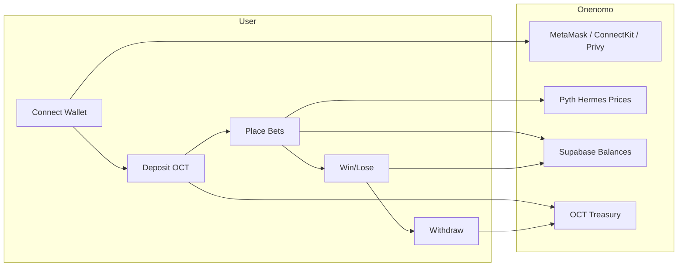
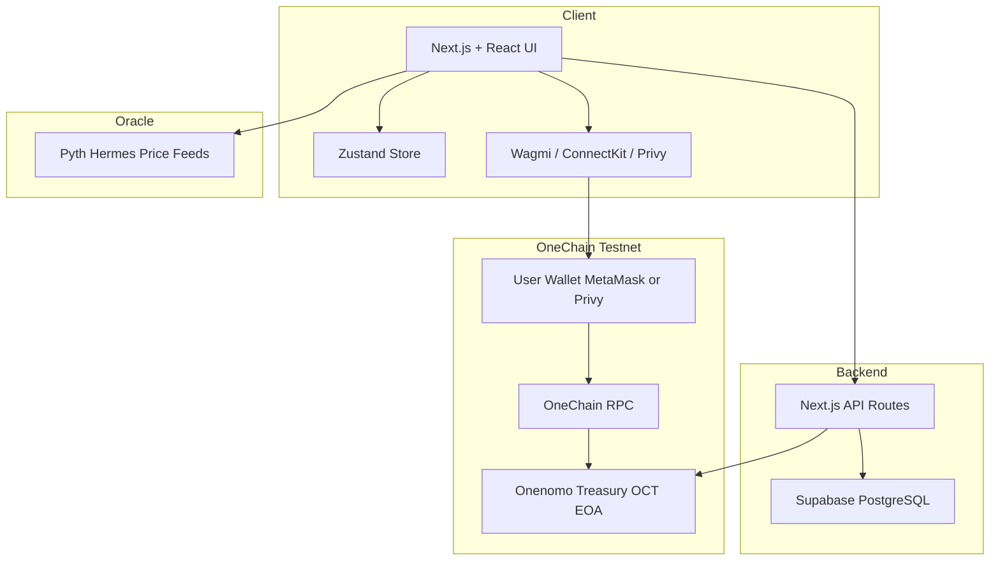
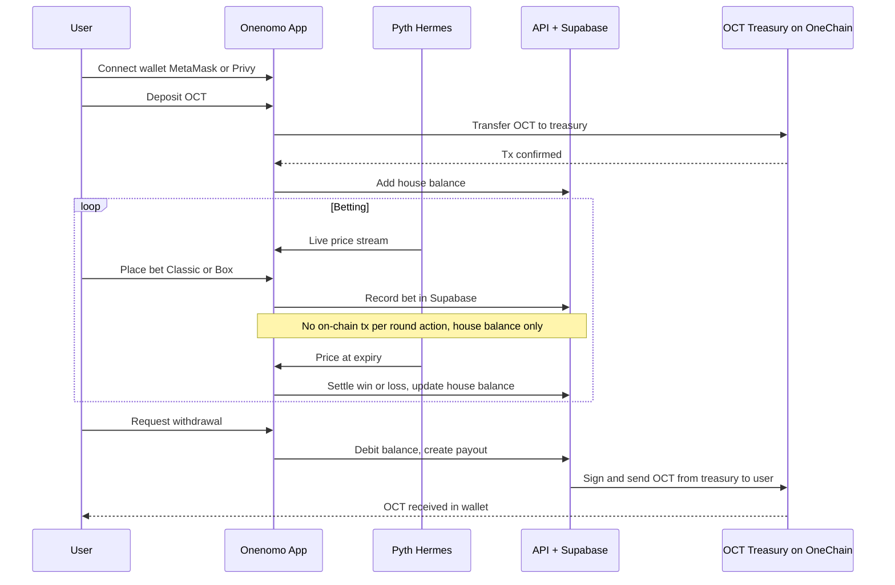
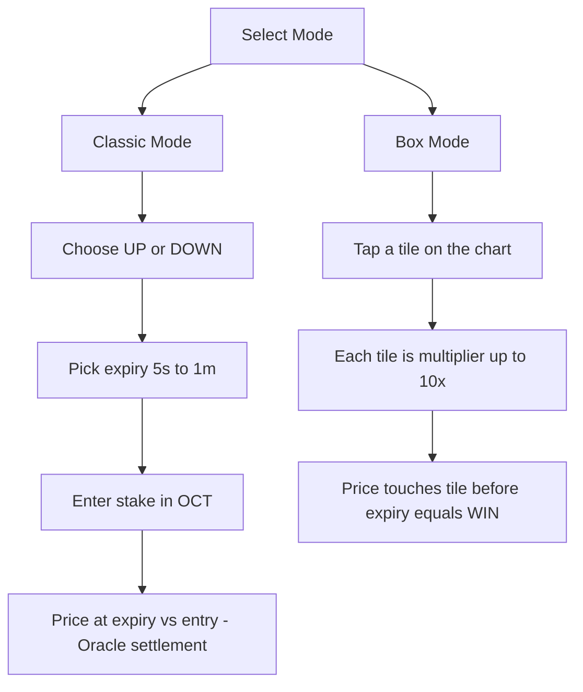

# Onenomo

[](https://opensource.org/licenses/MIT)
[](https://onechain.one/)
[](https://nextjs.org/)
[](https://www.typescriptlang.org/)

**A hybrid on-chain experience across GameFi + GambleFi + Prediction + Trading on OneChain testnet.**  
Running on **OneChain testnet**.

Powered by **OneChain testnet** + **Pyth Hermes** price attestations + **Supabase** + instant house balance.

*Play and trade short-duration prediction rounds with oracle-bound outcomes and on-chain treasury settlement.*

**Main treasury (OneChain testnet):** [`0x71197e7a1CA5A2cb2AD82432B924F69B1E3dB123`](https://explorer-testnet.onechain.one/address/0x71197e7a1CA5A2cb2AD82432B924F69B1E3dB123)


## Evaluation repository

**This public GitHub repository is the single source used for all evaluations.** It contains:

| Content | Location |
|--------|----------|
| **Core code** | `app/`, `components/`, `lib/`, `supabase/`, `scripts/` — full Next.js app, OneChain integration, Pyth, Supabase |
| **README** | This file — overview, quick start, tech stack, architecture, getting started |
| **Architecture & flow (`.md` + Mermaid)** | **README.md** (How It Works, System Architecture, Data Flow, Game Modes) |

All architectural and flow diagrams are in Markdown using [Mermaid](https://mermaid.js.org/) (rendered on GitHub). No evaluation materials live outside this repo.

---

## 📚 Documentation

- **[Quick Start](#getting-started)** - Get up and running in 5 minutes
- **[License](./LICENSE)** - MIT license details

**Open source:** This repository is public and **fork-friendly**. The project is licensed under [MIT](./LICENSE); see the [LICENSE](./LICENSE) file for the full text.

---

## Repository structure

| Path | Purpose |
|------|--------|
| `app/` | Next.js App Router pages and API routes |
| `components/` | React UI components (trade, chart, wallet) |
| `lib/` | OCT config, Supabase client, Pyth, utilities |
| `scripts/` | Balance sync, reconciliation, DB helpers |
| `supabase/` | SQL migrations and Supabase config |
| `public/` | Static assets |

---

## Why Onenomo?

Web3 still lacks a polished product that combines **playability**, **risk/reward excitement**, **prediction mechanics**, and **high-frequency trading-style execution** in one loop.

- **Pyth Hermes** delivers millisecond-grade prices for 300+ assets (crypto, stocks, metals, forex).
- **OneChain testnet** — EVM-compatible blockchain for fast finality and low fees.
- **House balance** — place repeated in-game actions without signing a transaction every round; only deposit/withdraw hit the chain.
- **5s, 10s, 15s, 30s, 1m** rounds with oracle-bound resolution.

Onenomo brings a unified **GameFi + GambleFi + Prediction + Trading** loop to OneChain testnet with transparent, testable mechanics and on-chain settlement touchpoints.

---

## MVP Status

This repository contains a **working MVP** with complete core flow:

- Connect wallet
- Deposit OCT to treasury
- Play Classic/Box rounds with live oracle pricing
- Resolve outcomes and update internal balance
- Withdraw OCT back to wallet

This is production-oriented in structure, with API routes, SQL migrations, and verifiable transaction paths.

---

## OneChain Ecosystem Alignment

Onenomo is designed as a native OneChain product with practical ecosystem fit:

- **OneWallet-compatible UX** through EVM wallet flows and standard wallet connection patterns.
- **OneChain-native OCT treasury flow** for deposits and withdrawals.
- **Move ecosystem-ready scope** by combining game mechanics, prediction logic, and trading-style session design that can evolve into deeper OneChain product integrations.
- **GameFi + GambleFi + Prediction + Trading direction** via two modes (Classic/Box), oracle-driven automated resolution logic, and data-ready foundations for AI-assisted gameplay features.

---

## Tech Stack

| Layer        | Technology |
|-------------|------------|
| **Frontend** | Next.js 16, React 19, TypeScript, Tailwind CSS, Zustand, Recharts |
| **Blockchain** | **OneChain testnet**, ethers.js, viem, Wagmi, ConnectKit, Privy |
| **Oracle** | Pyth Network Hermes (real-time prices) |
| **Backend** | Next.js API Routes, Supabase (PostgreSQL) |
| **Game & Trading Economy** | OCT-based balance, rewards, risk/reward rounds, and treasury-backed settlement |

### Key Dependencies & Acknowledgements

- **Next.js 16 & React 19** — core application framework and UI rendering.
- **TypeScript** — type-safe application codebase.
- **Tailwind CSS** — utility-first styling for a responsive trading UI.
- **Zustand** — lightweight global state for prices, rounds, and UI state.
- **Recharts** — charting library for price feeds and Box mode tiles.
- **Wagmi, viem, ethers.js & ConnectKit** — wallet integration and OneChain testnet RPC access.
- **Privy** — social login and embedded wallet experience.
- **Pyth Hermes** — real-time oracle prices for settlement.
- **Supabase (PostgreSQL)** — managed database, auth, and SQL migrations.

---

## Market Opportunity (GameFi + GambleFi + Prediction + Trading)

| Metric | Value |
|--------|--------|
| **Prediction gameplay demand** | Strong overlap with short-session, high-engagement game loops |
| **Crypto-native gaming audience** | Large base of wallet-ready users seeking interactive utility |
| **Risk/reward entertainment demand** | Persistent interest in competitive, stake-based digital experiences |
| **High-frequency retail behavior** | Strong preference for fast sessions, instant outcomes, and repeatable loops |
| **On-chain game economies** | Growing preference for transparent, composable reward systems |
| **Crypto users** | 590M+ worldwide |

---

## Positioning Landscape

| Segment | Examples | Limitation vs Onenomo hybrid model |
|--------|----------|----------------------|
| **Prediction markets** | Polymarket, Kalshi, Azuro | Primarily event markets; not built around sub-minute interactive rounds. |
| **On-chain derivatives UIs** | Perp/options apps | Finance-first workflows; lower emphasis on game loops and session-based play. |
| **Casual Web2 prediction apps** | Centralized mini-games | No on-chain transparency or wallet-native ownership patterns. |
| **Web2 gamble-style products** | Centralized casino/binary apps | Weak on transparency, custody, and verifiable settlement logic. |
| **OneChain game category** | Early-stage | Opportunity for a polished, playable prediction game with verifiable outcomes. |

**Onenomo’s differentiation:** A OneChain-native hybrid combining GameFi engagement, GambleFi-style risk/reward rounds, prediction-market logic, and trading-style speed with sub-second oracle resolution (Pyth Hermes), instant execution via house balance, and dual modes (Classic + Box).

---

## Future

Endless possibilities across:

- **Stocks, Forex** — Expand beyond crypto into traditional markets via oracles.
- **Options** — Standard options (calls/puts) on top of the same infrastructure.
- **Derivatives & Futures** — More products for advanced traders.
- **DEX** — Deeper DeFi integration and on-chain liquidity.

**Ultimate objective:** Build a category-defining hybrid experience across GameFi + GambleFi + Prediction + Trading on OneChain testnet, then expand into richer multiplayer, progression, and AI-assisted systems.

---

## How It Works


```mermaid
flowchart LR
    subgraph User
        A[Connect Wallet] --> B[Deposit OCT]
        B --> C[Place Bets]
        C --> D[Win/Lose]
        D --> E[Withdraw]
    end
    subgraph Onenomo
        F[MetaMask / ConnectKit / Privy]
        G[Pyth Hermes Prices]
        H[Supabase Balances]
        I[OCT Treasury]
    end
    A --> F
    B --> I
    C --> G
    C --> H
    D --> H
    E --> I
```

### Flow

1. **Connect** — Connect via MetaMask (ConnectKit/Wagmi) or Privy (social login). All operations use **OCT** on OneChain testnet.
2. **Deposit** — Send OCT from your wallet to the Onenomo treasury. Your house balance is added instantly.
3. **Play round** — Choose **Classic** (up/down + expiry) or **Box** (tap tiles with multipliers). No on-chain tx per round action.
4. **Resolution** — Pyth Hermes provides the price at expiry; win/loss is applied to your house balance.
5. **Withdraw** — Request withdrawal; OCT is sent from the treasury to your wallet on OneChain testnet.

---

## System Architecture


```mermaid
graph TB
    subgraph Client
        UI["Next.js + React UI"]
        Store["Zustand Store"]
        Wallets["Wagmi / ConnectKit / Privy"]
    end

    subgraph Oracle
        Pyth["Pyth Hermes Price Feeds"]
    end

    subgraph OCTChain["OneChain Testnet"]
        UserWallet["User Wallet MetaMask or Privy"]
        Treasury["Onenomo Treasury OCT EOA"]
        OneChainRPC["OneChain RPC"]
    end

    subgraph Backend
        API["Next.js API Routes"]
        DB["Supabase PostgreSQL"]
    end

    UI --> Store
    UI --> Wallets
    Wallets --> UserWallet
    UserWallet --> OneChainRPC
    OneChainRPC --> Treasury
    UI --> Pyth
    UI --> API
    API --> DB
    API --> Treasury
```

### Data Flow


```mermaid
sequenceDiagram
    participant U as User
    participant App as Onenomo App
    participant P as Pyth Hermes
    participant API as API + Supabase
    participant OCT as OCT Treasury on OneChain

    U->>App: Connect wallet MetaMask or Privy
    U->>App: Deposit OCT
    App->>OCT: Transfer OCT to treasury
    OCT-->>App: Tx confirmed
    App->>API: Add house balance

    loop Betting
        P->>App: Live price stream
        U->>App: Place bet Classic or Box
        App->>API: Record bet in Supabase
        Note over App,API: No on-chain tx per round action, house balance only
        P->>App: Price at expiry
        App->>API: Settle win or loss, update house balance
    end

    U->>App: Request withdrawal
    App->>API: Debit balance, create payout
    API->>OCT: Sign and send OCT from treasury to user
    OCT-->>U: OCT received in wallet
```

### Game Modes


```mermaid
flowchart TD
    Start[Select Mode] --> Classic[Classic Mode]
    Start --> Box[Box Mode]

    Classic --> C1[Choose UP or DOWN]
    C1 --> C2[Pick expiry 5s to 1m]
    C2 --> C3[Enter stake in OCT]
    C3 --> C4[Price at expiry vs entry - Oracle settlement]

    Box --> B1[Tap a tile on the chart]
    B1 --> B2[Each tile is multiplier up to 10x]
    B2 --> B3[Price touches tile before expiry equals WIN]
```

---

## Getting Started

### Prerequisites

- Node.js 18+
- Yarn (or npm)
- A OneChain testnet wallet (e.g. MetaMask) and some OCT
- Supabase project

### 1. Clone and install

```bash
git clone https://github.com/AmaanSayyad/Onenomo.git
cd Onenomo
yarn install
```

### 2. Environment variables

```bash
cp .env.example .env
```

Edit `.env` with the following variables. See `.env.example` for a complete template.

#### Required Variables

| Variable | Description |
|----------|-------------|
| `ONECHAIN_TREASURY_PRIVATE_KEY` | Treasury private key for withdrawals (⚠️ KEEP SECRET - server-side only) |
| `NEXT_PUBLIC_SUPABASE_URL` | Supabase project URL (required for database operations) |
| `NEXT_PUBLIC_SUPABASE_ANON_KEY` | Supabase anonymous key (required for database operations) |

#### OneChain Network Configuration (Optional - defaults provided)

| Variable | Default | Description |
|----------|---------|-------------|
| `NEXT_PUBLIC_ONECHAIN_TESTNET_RPC` | `https://rpc-testnet.onelabs.cc:443` | OneChain testnet RPC endpoint |
| `NEXT_PUBLIC_ONECHAIN_TESTNET_CHAIN_ID` | `0` | OneChain testnet chain ID |
| `NEXT_PUBLIC_ONECHAIN_TESTNET_EXPLORER` | `https://onescan.cc/testnet` | Block explorer URL |
| `NEXT_PUBLIC_ONECHAIN_TESTNET_CURRENCY` | `OCT` | Native currency name |
| `NEXT_PUBLIC_ONECHAIN_TESTNET_CURRENCY_SYMBOL` | `OCT` | Currency symbol for display |
| `NEXT_PUBLIC_ONECHAIN_TESTNET_CURRENCY_DECIMALS` | `9` | Native token decimals |
| `NEXT_PUBLIC_ONECHAIN_FAUCET_URL` | `https://faucet-testnet.onelabs.cc` | Testnet faucet endpoint |
| `NEXT_PUBLIC_ONECHAIN_OCT_COIN_TYPE` | `0x2::oct::OCT` | Client coin type for OCT |
| `ONECHAIN_OCT_COIN_TYPE` | `0x2::oct::OCT` | Server coin type for OCT |

#### Treasury Configuration (Optional - defaults provided)

| Variable | Default | Description |
|----------|---------|-------------|
| `NEXT_PUBLIC_ONECHAIN_TREASURY_ADDRESS` | _(set in `.env`)_ | Treasury address for client display |
| `ONECHAIN_TREASURY_PRIVATE_KEY` | _(set in `.env`)_ | Treasury private key (server-side) |

#### Wallet Connection (Optional)

| Variable | Description |
|----------|-------------|
| `NEXT_PUBLIC_WALLETCONNECT_PROJECT_ID` | WalletConnect project ID (get from [cloud.walletconnect.com](https://cloud.walletconnect.com)) |
| `NEXT_PUBLIC_PRIVY_APP_ID` | Privy app ID for social login (optional) |
| `PRIVY_APP_SECRET` | Privy app secret (⚠️ KEEP SECRET - server-side only) |

#### Application Configuration (Optional - defaults provided)

| Variable | Default | Description |
|----------|---------|-------------|
| `NEXT_PUBLIC_APP_NAME` | `Onenomo` | Application name displayed in UI |
| `NEXT_PUBLIC_OCT_NETWORK` | `testnet` | Network mode (`testnet` or `mainnet`) |
| `NEXT_PUBLIC_ROUND_DURATION` | `30` | Default round duration in seconds |
| `NEXT_PUBLIC_PRICE_UPDATE_INTERVAL` | `1000` | Price update interval in milliseconds |
| `NEXT_PUBLIC_CHART_TIME_WINDOW` | `300000` | Chart time window in milliseconds (5 minutes) |
| `ONECHAIN_ADAPTER_MODE` | `sui` | Adapter mode (`sui` or `evm`) |

**⚠️ Security Note:** Never commit `.env` to version control. All sensitive keys (private keys, secrets) should only be used server-side and never exposed to the client.

### 3. Supabase

1. Create a project at [supabase.com](https://supabase.com).
2. Run the SQL migrations in `supabase/migrations/` in the Supabase SQL Editor.

### 4. Run the app

```bash
yarn dev
```

Open [http://localhost:3000](http://localhost:3000); the app redirects to `/trade`.

### 5. Verify

- **Lint:** `yarn lint`
- **Tests:** `yarn test`
- No secrets in source: all keys and secrets live in `.env` (see [.env.example](./.env.example)); never commit `.env`.

---

## Architecture: How Onenomo Scales

Onenomo is designed for **high-throughput, low-latency** GameFi prediction rounds on OneChain testnet.

### Performance Characteristics

| Metric | Value | Notes |
|--------|-------|-------|
| **Round action throughput** | 1,000+ actions/second | Off-chain house balance (no tx per round action) |
| **Price updates** | 1-second interval | Pyth Hermes real-time feed |
| **Concurrent users** | 10,000+ | Supabase PostgreSQL + connection pooling |
| **Settlement latency** | <100ms | In-memory bet resolution + DB write |
| **Blockchain finality** | ~3 seconds | OneChain testnet block time |

### Scalability Strategy

1. **Off-chain execution engine**  
  - Round actions are placed against house balance (stored in Supabase)  
   - Only deposits/withdrawals hit the blockchain  
  - Eliminates gas costs and network congestion for gameplay loops

2. **Horizontal scaling**  
   - Stateless Next.js API routes (scale via Vercel/AWS)  
   - Supabase connection pooling (supports 10K+ connections)  
   - CDN caching for static assets

3. **Database optimization**  
   - Indexed queries on `wallet_address`, `resolved_at`  
   - Partitioned tables for bet history (monthly partitions)  
   - Read replicas for analytics queries

4. **Treasury management**  
   - **Phase 1 (current)**: Single EOA treasury  
   - **Phase 2 (Q2 2026)**: Multi-sig treasury (Gnosis Safe 3-of-5)  
   - **Phase 3 (Q3 2026)**: Smart contract vault with time-locks

5. **Risk mitigation**  
   - **Insurance fund**: 5% of protocol fees reserved for edge cases  
   - **Liquidity reserves**: 70% OCT, 20% USDT, 10% yield-bearing (Venus)  
   - **Circuit breaker**: Auto-pause if oracle deviation >5% or treasury <10% reserves

---

## Economy & Sustainability

### Economy Streams

| Source | Model | Destination |
|--------|----------|-------------|
| **Round fees** | 1.5-2% per resolved round | 70% treasury reserves, 20% insurance fund, 5% team, 5% community |
| **Referral rewards** | 10% of referee-generated fees | Paid from protocol fee allocation |
| **VIP progression** | Activity/volume-based tiering | Incentivizes retention and deeper gameplay |
| **Future: Token staking** | Variable APY / utility | Aligns long-term player incentives |

### Sustainability Plan

**Treasury Reserve Management:**
- Maintain **minimum 30% reserves** (if reserves drop below, pause bets until replenished)
- **Yield generation**: Deposit idle OCT into Venus Protocol (~5% APY)
- **Dynamic fee adjustment**: Increase fees if treasury health <50%, decrease if >80%

**Insurance Fund:**
- Covers oracle failures, smart contract exploits, or extreme loss events
- Target: $100K by end of 2026 (currently accumulating 5% of fees)

**Liquidity Incentives:**
- **Early users**: Bonus multipliers for first 30 days (1.1x payouts)
- **Liquidity mining**: Stake Onenomo tokens to earn protocol fee share (planned Q3 2026)
- **Referral bonuses**: 10% of fees from referred users (permanent)

**Long-term Revenue Targets:**

| Quarter | Users | Daily Volume | Monthly Revenue | Treasury TVL |
|---------|-------|--------------|-----------------|--------------|
| Q1 2026 | 1,000 | $10K | $6K | $50K |
| Q2 2026 | 5,000 | $50K | $30K | $250K |
| Q3 2026 | 20,000 | $250K | $150K | $1M |
| Q4 2026 | 50,000 | $1M | $600K | $5M |

**Break-even:** Estimated at 2,500 active users with healthy daily round volume (target Q2 2026)

---

## Adoption & Growth Plan / Go‑to‑Market

### Target Segments

- **GameFi-native players on OneChain testnet** — users seeking competitive, short-session on-chain gameplay.
- **Prediction + trading-native users (Web2 → Web3)** — users wanting transparent, wallet-native outcomes with fast session velocity.
- **Risk/reward entertainment users** — users who prefer high-intensity rounds with clear rules and verifiable settlement.
- **Creators & communities** — KOLs and Telegram/Discord communities that drive social and competitive play loops.

### Acquisition Channels

- **OneChain testnet ecosystem**: Grants, ecosystem programs, and co-marketing with OneChain testnet and infra partners.
- **X/Twitter & Telegram**: Short-form gameplay clips, win streaks, and leaderboard moments for virality.
- **Referral program**: Perpetual fee share for referrers, with deep links into Classic and Box modes.
- **Launch partners**: Early integrations with wallets, analytics dashboards, and trader communities.

### Activation & Retention

- **Onboarding quests**: Complete first deposit and 3 rounds to unlock boosted odds or fee discounts.
- **Streaks & leaderboards**: Daily/weekly leaderboards for hit-rate, multipliers, and volume.
- **VIP tiers**: Volume-based tiers with better odds, early access to new assets, and governance rights.
- **Education & transparency**: Clear docs about oracle settlement, treasury health, and risk disclosures.

### Expansion Roadmap

- **Phase 1 (OneChain testnet focus)**: Ship on OneChain, harden infra, iterate on UX and risk parameters.
- **Phase 2 (More assets & regions)**: Expand to FX, indices, and region-specific campaigns.
- **Phase 3 (Cross-chain & tokenization)**: Onenomo token, cross-chain deployment, and deeper DeFi integrations.

---

## OneChain Testnet

Onenomo is built for **OneChain testnet**:

- Deposits and withdrawals are OCT transfers on OneChain testnet.
- Treasury is an EOA on OneChain testnet; no custom contract required for core flow.
- Wallet connection via ConnectKit (MetaMask, etc.) and Privy.
